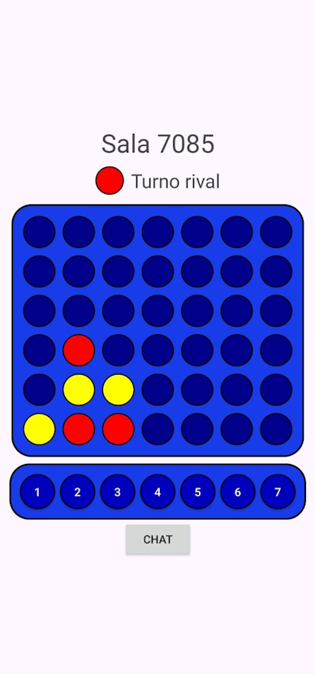
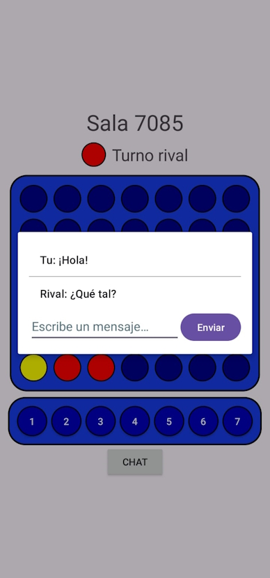
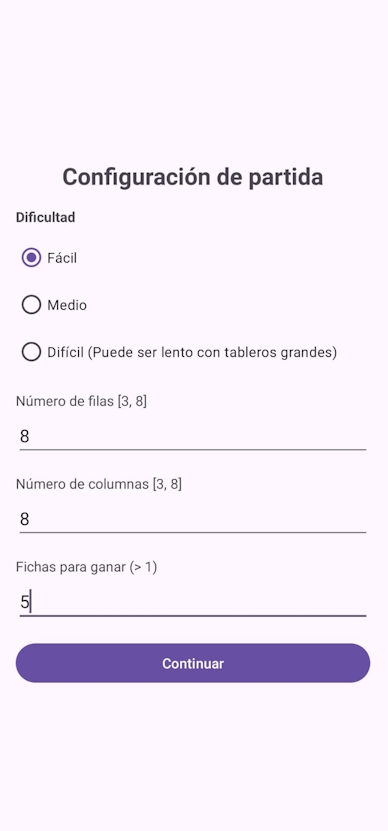

# Conecta Plus 🎮

¡Bienvenido a **Conecta Plus**! Este proyecto trae una nueva versión del clásico Conecta 4 con un diseño moderno y características ampliadas. Disfruta de partidas en modo **SinglePlayer** (con dificultad configurable) o desafía a un amigo en **MultiPlayer** con un emocionante chat en tiempo real.

---

## 🎲 Características principales

- **Modo SinglePlayer**: Juega contra una IA configurable en los modos Fácil, Medio y Difícil.
- **Modo MultiPlayer**: Juega con otro usuario a través de nuestro servidor WebSocket.
- **Historial de partidas**: Guarda resultados, fechas y modos de juego.
- **Soporte multilingüe**: Cambia el idioma entre Español, Inglés o Árabe desde las opciones.
- **Interfaz intuitiva**: Diseño amigable y adaptado a cualquier usuario.

---

## 📸 Juego

### Multijugador
<p align="center">
  
  
</p>

### Modo contra la IA
<p align="center">
  
  
</p>

---

## 🚀 Instalación y configuración

Sigue estos pasos para instalar y configurar tanto la aplicación Android como el servidor Python:

### 1️⃣ Clonar el repositorio
```bash
git clone https://github.com/usuario/conecta-plus.git
cd conecta-plus
```

### 2️⃣ Configurar la aplicación Android
1. Abre el proyecto en **Android Studio**.
2. Localiza la clase `WebSocketSingleton` en el código fuente.
3. Cambia el valor de `WS_URL` a la URL donde despliegues tu servidor Python. Ejemplo:
   ```java
   private static final String WS_URL = "ws://<DIRECCIÓN_DEL_SERVIDOR>:<PUERTO>";
   ```
4. Asegúrate de incluir esta dirección en el archivo `network_security_config.xml`.
5. Compila e instala la app en tu dispositivo Android.

### 3️⃣ Desplegar el servidor Python
1. Instala las dependencias necesarias:
   ```bash
   pip install websockets asyncio
   ```
2. Ejecuta el servidor:
   ```bash
   python server.py
   ```
3. El servidor estará escuchando en el puerto que hayas configurado.

---

## 🕹️ Cómo jugar

### SinglePlayer
1. Configura las opciones del tablero y la dificultad de la IA.
2. Empieza a jugar y conecta tus fichas antes que la IA.

### MultiPlayer
1. Crea una sala o únete a una con un código.
2. Usa el chat para comunicarte y empieza a competir.

---

## 🙌 Agradecimientos

Este proyecto utiliza partes del código del repositorio [AI-AlgorithmsGames](https://github.com/jmhorcas/AI-AlgorithmsGames) creado por [jmhorcas](https://github.com/jmhorcas).

---

¡Gracias por probar **Conecta Plus**! 🎉
